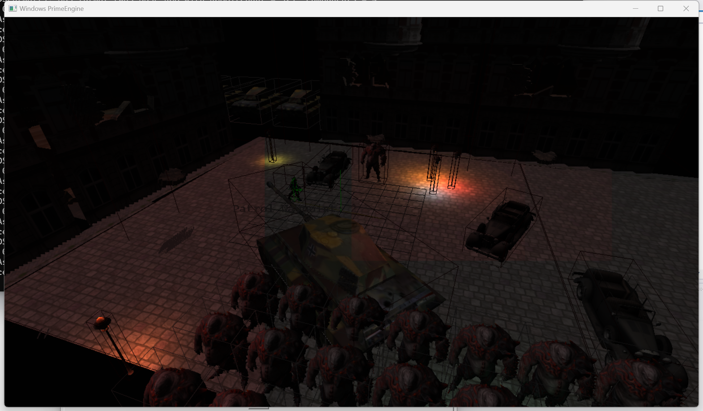
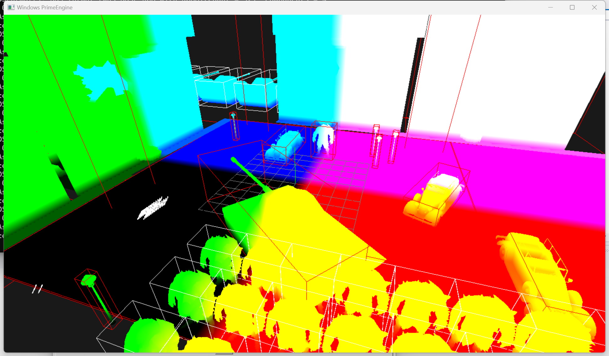
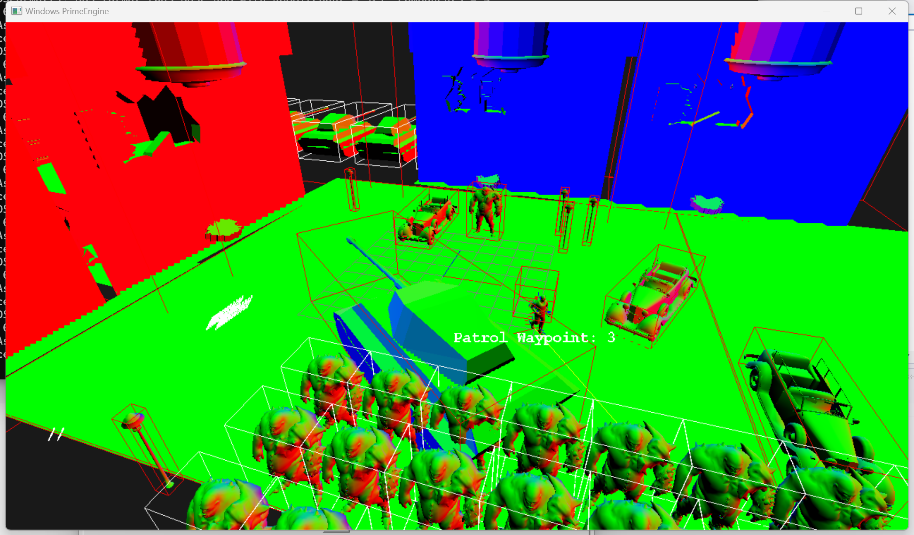
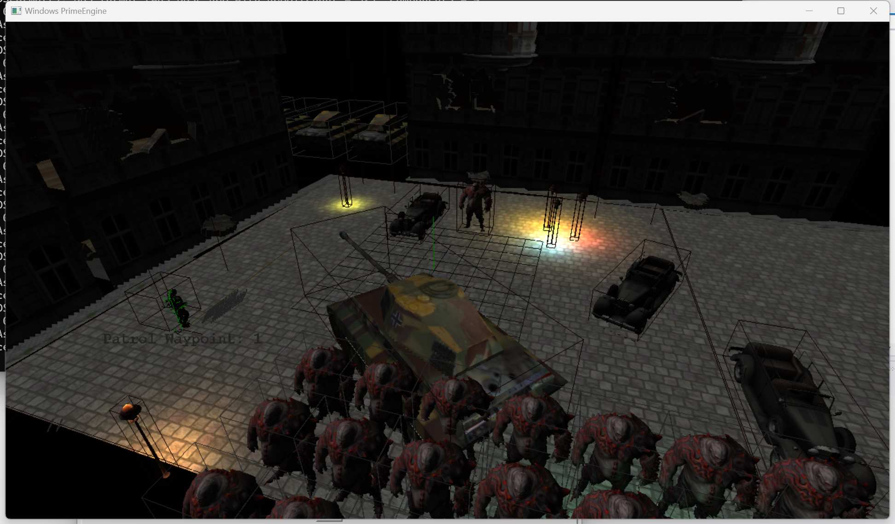
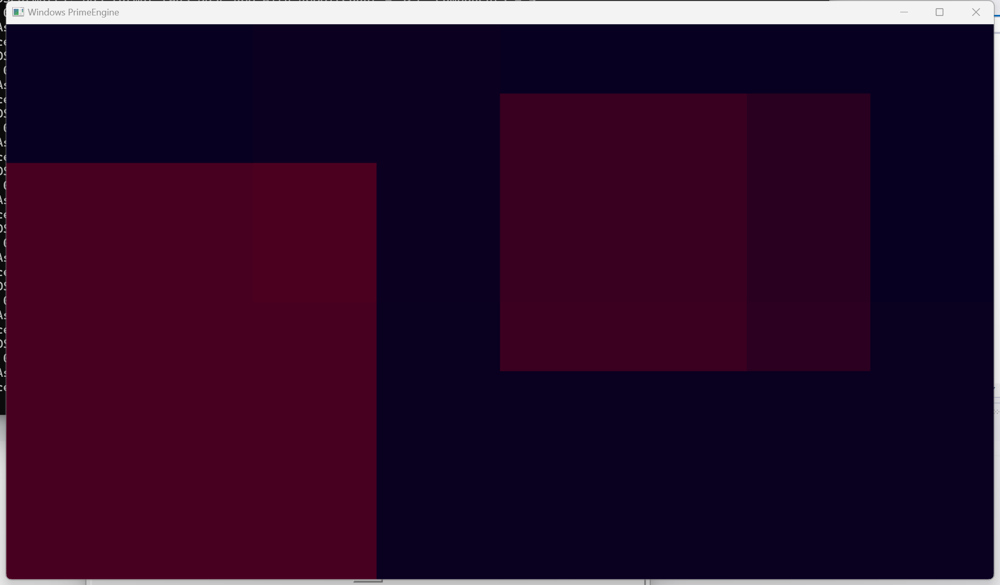

# Prime Engine — Tiled Deferred Rendering Support

**Tiled Deferred Rendering Support** is a new, advanced graphics pipeline developed for the Prime Engine (created in the *Game Engine Development* class with Prof. Artem). This project extends the original forward rendering system into a deferred rendering pipeline and implements tiled optimization to improve lighting performance in large scenes.

---

## 🎥 Demonstration

**Demo Video:**  
https://youtu.be/RuhRq3YNMEU_[- YouTube](https://youtu.be/RuhRq3YNMEU)

**Screenshots:**  

---

## 🔧 Technical Overview

To protect the proprietary codebase of Prime Engine, only the most relevant implementation details are shared here.

---

### G-Buffer Writing

The `GPUProgram/GBufferWrite` shader handles rendering object groups into the G-buffer. It retrieves geometry and material data from the `MeshObject` and `MaterialComponent`, then writes to a layered render target group using OpenGL's **Multiple Render Targets (MRT)**. This enables drawing to several textures in a single pass.

**G-Buffer Structure:**

| Render Target | Contents                      |
| ------------- | ----------------------------- |
| RT0           | Albedo (RGBA)                 |
| RT1           | Position (RGB) + Glowness (A) |
| RT2           | Normal (RGB) + Specular (A)   |

> 🦴 Skinned models use a different shader: `GBufferWriteSkin_ps.cgvs`, which includes joint weight blending.

---

### Deferred Shading

The second stage performs lighting computations in screen space using the G-buffer. Implemented in `DeferredLightShading_PS.cgps`, lighting is calculated **per-pixel**, providing much better scalability than forward rendering.

All necessary data—position, normal, albedo, glowness, specular—is read from the G-buffers, and lighting contributions are accumulated from all relevant light sources.

---

### Tiled Optimization

To optimize lighting in scenes with many static lights, we implemented **Tiled Deferred Rendering**.

#### Step 1: Tile-Based Light Culling

- The screen is divided into tiles (e.g., 8×8 pixels).
- Each tile’s view frustum is tested against static light bounding volumes (BOVs).
- Lights are grouped per tile, reducing unnecessary lighting computations.

#### Step 2: GPU Integration Without Compute Shaders

Since Prime Engine uses a traditional pipeline (CgGL), compute shaders are not supported.

**Alternative Implementation:**

- A new G-buffer texture of size `gridNum × gridNum` is created (1 pixel per tile).
- Each pixel uses the `GLuchar` format (4 × 8-bit channels).
- Each channel serves as a **bitmask** for 8 lights (total: 32 light sources).
- In our test with 8 lights, only the red channel is utilized.

This workaround replicates compute shader behavior and enables GPU-driven tiled lighting, even on legacy systems.

---

## Summary

This project demonstrates an effective implementation of **deferred rendering** and **tiled light culling** using legacy GPU tools. It significantly improves performance and lighting scalability in scenes with many lights—without requiring modern compute shader support.